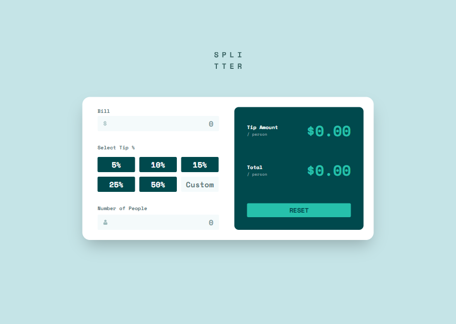
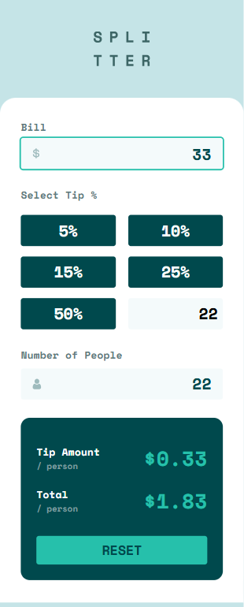

# Frontend Mentor - Tip calculator app solution

This is a solution to the [Tip calculator app challenge on Frontend Mentor](https://www.frontendmentor.io/challenges/tip-calculator-app-ugJNGbJUX). Frontend Mentor challenges help you improve your coding skills by building realistic projects.

## Table of contents

- [Overview](#overview)
  - [The challenge](#the-challenge)
  - [Screenshot](#screenshot)
  - [Links](#links)
- [My process](#my-process)
  - [Built with](#built-with)
  - [What I learned](#what-i-learned)
  - [Useful resources](#useful-resources)
- [Author](#author)

## Overview

### The challenge

Users should be able to:

- View the optimal layout for the app depending on their device's screen size
- See hover states for all interactive elements on the page
- Calculate the correct tip and total cost of the bill per person

### Screenshot

### Links

- Solution URL: [https://www.frontendmentor.io/solutions/responsive-tip-calculator-using-tailwind-css-and-vanilla-javascript-RWQrG2jdVk](https://www.frontendmentor.io/solutions/responsive-tip-calculator-using-tailwind-css-and-vanilla-javascript-RWQrG2jdVk)
- Live Site URL: [https://fadymas.github.io/tip-calculator-app-main/](https://fadymas.github.io/tip-calculator-app-main/)

## My process

### Built with

- Semantic HTML5 markup
- CSS custom properties
- Flexbox
- Mobile-first workflow
- [Tailwind](https://tailwindcss.com/) - Css library

### What I learned

I learned how to build I learned how to build responsive layouts that adapt to different screen sizes

### Useful resources

- [Tailwind CSS Documentation](https://tailwindcss.com/docs) – Helped me understand how to use responsive utility classes and how to apply spacing, typography, and custom colors effectively.

## Author

- Frontend Mentor - [@fadymas](https://www.frontendmentor.io/profile/fadymas)

- LinkedIn - [@fady-mahros](www.linkedin.com/in/fady-mahrous)
